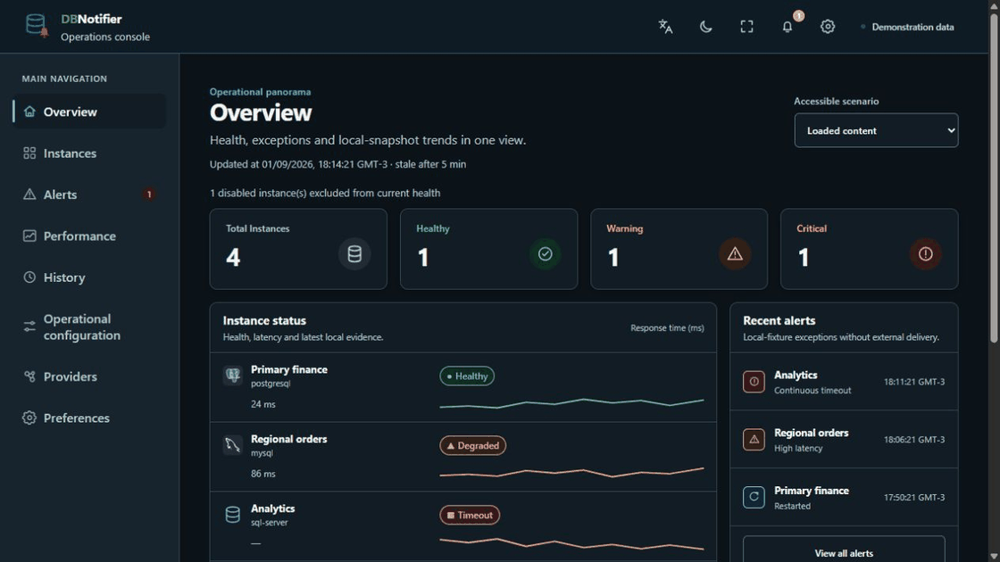
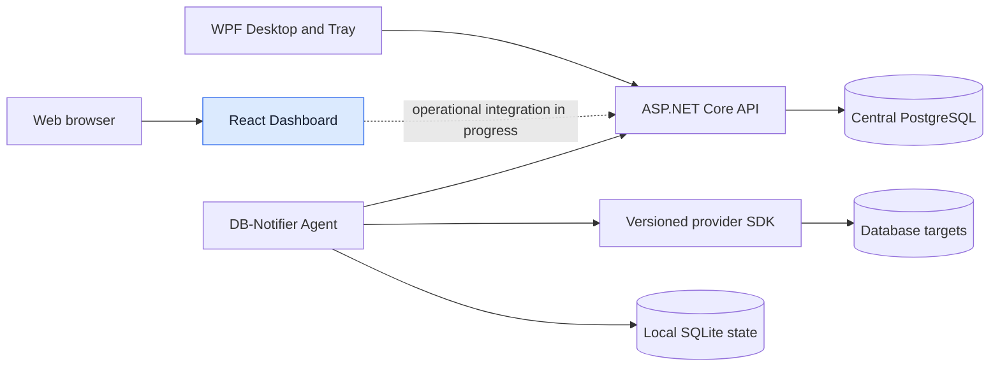

# DB-Notifier

<p align="center">
  
</p>

<p align="center">
  <strong>A provider-neutral database observability portfolio built across web, desktop, API and agent boundaries.</strong>
</p>

<p align="center">
  
  
  
  
  <a href="LICENSE"></a>
</p>

> [!IMPORTANT]
> **Portfolio preview — work in progress.** The hosted Dashboard and the demonstration below use deterministic synthetic data. Live database monitoring, provider homologation, administrative execution and production operation are not enabled.

<picture>
  <source media="(prefers-reduced-motion: reduce)" srcset="docs/assets/db-notifier-demo.png" />
  
</picture>

<p align="center"><em>Demonstration mode using deterministic local data. No external database or personal data is shown.</em></p>

DB-Notifier explores how a secure, agent-based platform can observe heterogeneous database fleets without coupling its core domain to one engine, operating system or user interface. It combines a responsive React Dashboard, a Windows notification-area experience, ASP.NET Core APIs, local and central persistence boundaries, and versioned provider contracts.

## What this project demonstrates

- **Full-stack architecture:** .NET 10 domain, application, API, persistence, Agent and WPF boundaries alongside a React and TypeScript Dashboard.
- **Provider-neutral design:** versioned provider contracts, stable identifiers and normalised outcomes without engine-specific rules in the core domain.
- **Operational UX:** inventory, health, alerts, history, provider capabilities, Light/Dark themes, localisation and a TV presentation mode.
- **Security by design:** deny-by-default capabilities, separated identities, opaque credential references, bounded network egress and auditable decisions.
- **Resilient data flow:** offline Agent storage, idempotency, outbox/reconciliation concepts, explicit freshness and unknown/stale states.
- **Engineering discipline:** automated tests, architecture checks, accessibility contracts, deterministic generated assets, locked dependencies and CI.

## Project status

| Area | Current state |
| --- | --- |
| Web Dashboard | Demonstration interface with deterministic synthetic data |
| Hosted preview | Render Static Site configuration; static demonstration only |
| Windows Desktop and Tray | Implemented surfaces with integration work still in progress |
| Agent and API | Implemented architecture with bounded local integration evidence |
| Database providers | Provider-neutral contracts; no provider advertised as operationally homologated |
| Administrative actions | Disabled unless their exact capability and security contracts are proved |
| Production readiness | Not production-ready |

The repository remains in `STATE-06 INTEGRATION`. The factual engineering snapshot lives in [`prompts/state/Current-State.md`](prompts/state/Current-State.md); historical reports remain evidence rather than release claims.

## Architecture



Only the Dashboard's deterministic demonstration composition is intended for the hosted portfolio preview. Agents remain close to database targets, and the Windows client remains a separate endpoint experience.

## Technology stack

| Layer | Technologies |
| --- | --- |
| Web | React 18, TypeScript, Vite, generated design tokens |
| API and application | .NET 10, ASP.NET Core, C# |
| Desktop | WPF on .NET 10, Windows notification area |
| Agent and persistence | .NET 10, SQLite, PostgreSQL, idempotent messaging patterns |
| Quality | xUnit, Node test runner, PowerShell/Pester, architecture and accessibility checks |
| Delivery | GitHub Actions, locked restores, Render Static Site preview |

## Run the Dashboard demonstration

Prerequisites:

- Node.js `>=24.18.0 <25.0.0`
- npm `>=11.16.0 <12.0.0`

```powershell
cd src/DBNotifier.Dashboard.Web
npm ci --ignore-scripts --no-audit --no-fund
npm run build
npm run preview -- --host 127.0.0.1 --port 4173
```

Open `http://127.0.0.1:4173`. The normal Dashboard composition is self-contained and uses synthetic data; no database, Agent, API, identity provider or secret is required.

For the complete repository workflow, use:

```powershell
./scripts/development.ps1 Doctor
./scripts/development.ps1 Quick
./scripts/development.ps1 Full
```

`Quick` is development feedback only. `Full` is the canonical aggregate repository gate when all declared prerequisites are available.

## Repository map

```text
src/
├── DBNotifier.Domain/                    Core domain model
├── DBNotifier.Application/               Use cases and policies
├── DBNotifier.Provider.Abstractions/      Versioned provider SDK
├── DBNotifier.Agent/                      Edge monitoring agent
├── DBNotifier.Server.Api/                 Central ASP.NET Core API
├── DBNotifier.Persistence.*/              SQLite and PostgreSQL adapters
├── DBNotifier.Desktop.Wpf/                Windows desktop and tray client
└── DBNotifier.Dashboard.Web/              React portfolio preview

tests/                                     Unit, integration and architecture checks
docs/                                      Architecture, design and factual evidence
prompts/                                   Governed requirements and current state
scripts/                                   Deterministic development and CI entry points
```

## Roadmap

- [x] Establish provider-neutral contracts and architecture boundaries.
- [x] Build the responsive deterministic Dashboard demonstration.
- [x] Implement Agent, API, persistence and Windows client foundations.
- [ ] Complete the active integration increments and canonical gates.
- [ ] Homologate providers independently by engine, version and topology.
- [ ] Package supported Windows and Agent distributions.
- [ ] Progress from evidence-grounded observations to separately gated recommendations and controlled automation.

## Design, accessibility and engineering notes

The UI follows the [`DB-Notifier Design System`](docs/design/DB-Notifier-Design-System.md), including semantic Light/Dark themes, keyboard navigation, visible focus, non-colour status cues, responsive layouts and Windows High Contrast considerations. Technical decisions are recorded under [`docs/architecture`](docs/architecture/README.md), while [`docs/Development.md`](docs/Development.md) documents the development workflow.

## Project lineage

DB-Notifier is the independent successor to PgNotifier. Under `GOV-MN-RESTORE-01`, MySQL Notifier may inform sanitised, observable and non-expressive functional outcomes. It is not an implementation base: DB-Notifier does not import Oracle/MySQL source expression, binaries, branding, artwork or vendor-specific implementation. The code, tests and product assets remain independently authored and provider-neutral, and database engines enter only through independently governed versioned providers/plugins.

## Security

This is not a production service. Please read [`SECURITY.md`](SECURITY.md) before reporting a vulnerability, and never include credentials, connection strings or other secret material in an issue.

## Licence

DB-Notifier is available under the [MIT Licence](LICENSE). Third-party attributions are recorded in [`THIRD-PARTY-NOTICES.md`](THIRD-PARTY-NOTICES.md).

---

<p align="center">Designed and developed by Bruno as an evolving full-stack engineering portfolio.</p>
